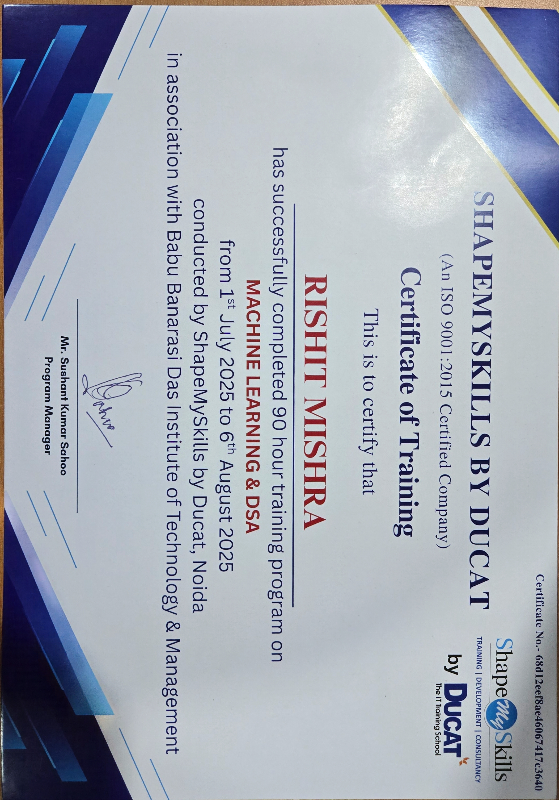

# ML Training Model Zoo

Hands-on machine learning training repository covering lecture modules 05 to 18.

## Contents

- `05-exploratory-data-analysis`: EDA with Iris and Ames Housing datasets
- `06-linear-regression`: Linear regression basics with salary data
- `07-feature-engineering`: Encoding and preprocessing pipeline concepts
- `08-regularization`: Ridge and Lasso regularization
- `09-logistic-regression`: Logistic regression with Titanic dataset
- `11-naive-bayes`: Naive Bayes notebooks (Iris and Spam)
- `12-svm`: Support Vector Machine classification
- `13-decision-trees`: Decision Tree classification
- `14-knn`: KNN classification
- `17-xgboost`: XGBoost classification and reference paper
- `18-kmeans-clustering`: K-Means clustering
- `Certification.jpg`: Training certification

## Goal

This repository is prepared for portfolio and GitHub publication, preserving notebook work, datasets, and practice files from ML training sessions.

## Training Certification

This repository also includes the training certification received for completing the program.

